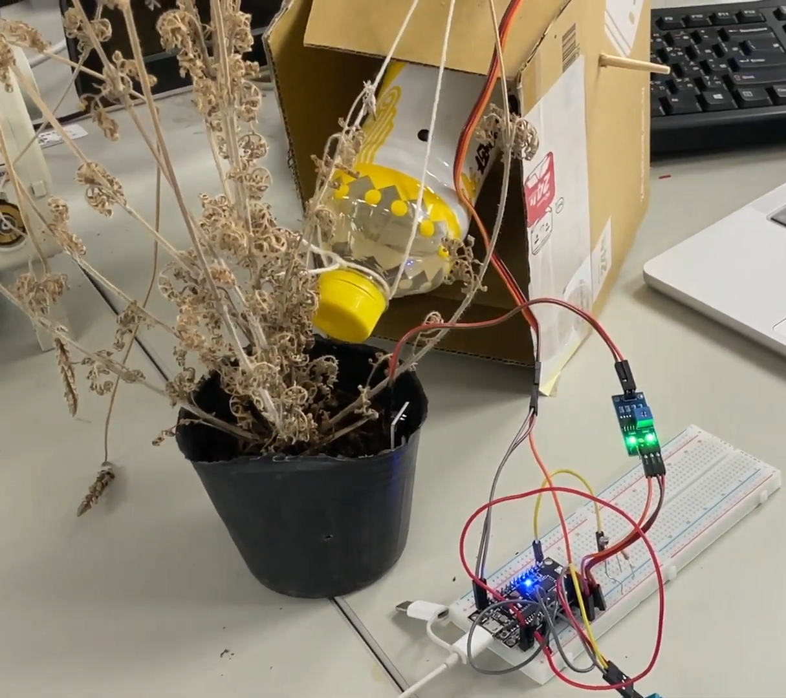
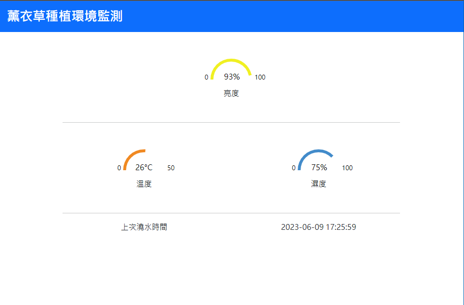
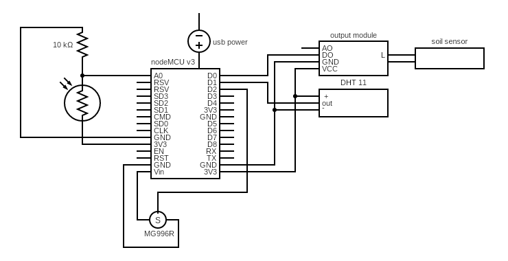
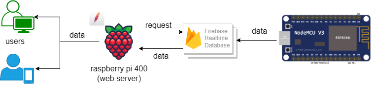

# 111_2_OpenSourceTermProject

植物環境監測系統

---

### 功能

- 監測裝置  
  使用 NodeMCU v3 連接各式感測器，設定好 configs.json 後 NodeMCU 就可以將感測資料上傳到 Firebase，同時藉由土壤溼度感測模組判斷土壤是否乾燥，進而驅動馬達旋轉，調整澆水裝置。  
  

- 監測網頁  
   使用 [public](./web/public) 資料夾內的 html, css, js 檔，並設定好 configs.json 後，就可以藉由網頁遠端取得監測裝置上傳的資料，也可以將網頁放在想要的伺服器上，使用不同的裝置存取網頁，在使用上更加方便  
  

---

### 電路圖與系統架構圖

- 電路圖  
  
- 系統架構圖
  
